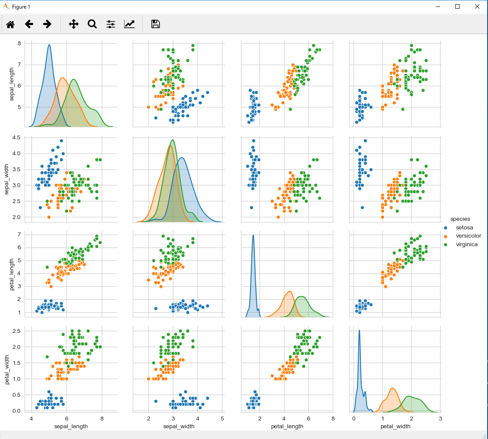

# 1.0 Introduction
This Git Hub repository contains all the files created during my completion of the Programming and Scripting Project 2019 as part of the H.Dip in Data Analytics.  This README contains a summary and my investigations into Fisher’s Iris data set.

# 2.0 Project Objective
The objective of this project is to research Fisher’s Iris data set and write documentation and code in the Python programing language based on the research carried out.  The outline for this project is:
1. Research background information about the data set and write a summary about it.
2. Keep a list of references you used in completing the project.
3. Download the data set and write some Python code to investigate it.
4. Summarise the data set in Python by, calculating the maximum, minimum and mean of each column of the data set. 
5. Write a summary of your investigations.
6. Include supporting tables and graphics.

# 3.0 About the Iris Data Set
The Iris flower data set or Fisher’s Iris data set is a multivariate data set introduced by the British statistician and biologist Ronald Fisher in his 1936 paper “The use of multiple measurements in taxonomic problems as an example of linear discriminant analysis”. This is a very famous and widely used dataset by everyone trying to learn machine learning and statistics. The data set consists of 50 samples from each of three species of the Iris flower 
•	Iris Versicolor 
•	Iris Virginica 
•	Iris Setosa

Four features were measured from each flower sample 
1.	Length of the petal in cm
2.	Width of the petal in cm
3.	Length of the sepal in cm
4.	Width of the sepal in cm
 

The fifth column in the data set is the species of the flower observed.
Analysis of the Iris Data Set

# 4.0 Analysis of the Iris Data Set
## 4.1 Importing Libraries
To complete the analysisy for this project I imorted the following modules, functions and objects:

Instructions for loading the data set:
Import Libraries
Load data set
 - Use pandas to load the data
 - Use pandas to explore the data
  

## Summarize the data set

# Conclusion

# References
1.	Wikipedia: Iris flower data set (https://en.wikipedia.org/wiki/Iris_flower_data_set)
2.	Your First Machine Learning Project in Python Step-By-Step (https://machinelearningmastery.com/machine-learning-in-python-step-by-step/)
3.	+20 ML Algorithms +15 Plot for Beginners (https://www.kaggle.com/mjbahmani/20-ml-algorithms-15-plot-for-beginners)
4. Youtube Channel: Applied AI Course (https://www.youtube.com/channel/UCJINtWke3-FMz2WuEltWDVQ)

