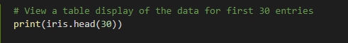

# 1 Introduction
This GitHub repository contains all the files created during my completion of the Programming and Scripting Project 2019 as part of the H.Dip in Data Analytics.  This README contains a summary and my investigations into Fisher’s Iris data set.

# 2 Project Objective
The objective of this project is to research Fisher’s Iris data set and write documentation and code in the Python programing language based on the research carried out.  The outline for this project is:
1. Research background information about the data set and write a summary about it.
2. Keep a list of references you used in completing the project.
3. Download the data set and write some Python code to investigate it.
4. Summarise the data set in Python by, calculating the maximum, minimum and mean of each column of the data set. 
5. Write a summary of your investigations.
6. Include supporting tables and graphics.

# 3 About the Iris Data Set
The Iris flower data set or Fisher’s Iris data set is a multivariate data set introduced by the British statistician and biologist Ronald Fisher in his 1936 paper “The use of multiple measurements in taxonomic problems as an example of linear discriminant analysis”. This is a very famous and widely used dataset by everyone trying to learn machine learning and statistics. The data set consists of 50 samples from each of three species of the Iris flower 
•	Iris Versicolor 
•	Iris Virginica 
•	Iris Setosa

Four features were measured from each flower sample 
1.	Length of the petal in cm
2.	Width of the petal in cm
3.	Length of the sepal in cm
4.	Width of the sepal in cm
 

The fifth column in the data set is the species of the flower observed.
Analysis of the Iris Data Set

# 4 Analysis of the Iris Data Set

## 4.1 Running to Code for Iris Data Set Project
**How to download the repository for this project:**

1. Go to GitHub
2. Project repository URL for Project 2019 is: https://github.com/pauladaly/pands-project.git
3. Click the download button

**How to run the code**

1. Have python installed on your system - I have Python 3.7 downloaded from https://www.anaconda.com/download/
2. Have Cmder installed on your system to run the command line -  can be downloaded from https://cmder.net/
3. Open the code on Visual Studio - can be downloaded from https://code.visualstudio.com/download
4. Open Cmder
5. On the command line enter the following to run each solution:
    - pands-project.py
6. Alternatively the code can be ran through the ipython terminal on Visula Studio

## 4.2 Importing Libraries
To complete the analysis for this project I imported the following modules, functions and objects:

## 4.3 Importing the data set
For this project I saved the Iris Data Set to my GitHub Repository and read the file from there using the Pandas package in python and used the read_csv() function.

## 4.4 Summary of the Data Set
To review the data within the data set I looked at the data in different ways:
1. Dimensions of the dataset
2. Viewed the data 
3. Statistical summary of all the attributes
4. Patterns within the data set

### 4.4.1 Dimensions of the dataset
To get a better understanding of the amount of data that was within the data set I ran the following python code to view the dimensions of the data set.

 

This showed that there are 150 instances and 5 attributes within the data set.

 

### 4.4.2 The Data
To get an idea of what the data set looked like I wanted to view the column names, the types of species within the dataset and I wanted to take a look at the data set in a table view for the first 30 data set entries and for a random sample of 20 entires. To get this information I ran the following code to get the outputs.

**Column Names within the data set**

 

By using (iris.columns) from pandas I can see the names of all the columns within the data set

 

**Types of Species and their count within the data set**

 

iris["species"]Value_counts() shows me that there are 3 different species and 50 rows of data for each species.

 

**Table view of the first 30 entries on the data set**

To see the data in a table format I used print(iris.head(30)) to view the first 30 records.

 

 

**Sample of 20 entries within the data set**

To get a feel for the data set I wanted to view a sample of the data, to do this I used the sample function.

 

The result of print(iris.sample(20)) provided me with a selection of each species rather than just the first 30 records which i got back when I used the head function and all these records were only for the species setosa. 

### 4.4.3 Statistical Summary

To get the basic statistics for the iris data set I ran the .describe() method from pandas.

 

The out put shows the break down of the iris data set.

 

I then wanted to see the staticstic for each species within the data set, this is what I ran to view this detail.

 

The statistical details for the Iris species Setosa are:

 

The statistical details for the Iris species Versicolor are:

 

The statistical details for the Iris species Virginica are:

 

### 4.4.4 Patterns within the data set
To explore the Iris data set even further I wanted to visually see if there was any patterns within the data set.
I created a 2D scatter diagram from the .plot library in pandas where I plotted the sepal_length (x axis) against the sepal_width (y axis)

It was hard to distinguish between each species on the 2D scatter diagram so I then added colour codeing and a Legend to it using the FacetGrid from the seaborn library.

I also used the pairplot feature from the seaborn library, which showed the bivariative relation between each of the species.

This first pairplot shows the joint relationships and histograms for univariate distributions

The second pairplot shows the different levels of a categorical variable by the color of plot elements

# 5 Conclusion

# 6 References
1.	Wikipedia: Iris flower data set (https://en.wikipedia.org/wiki/Iris_flower_data_set)
2.	Your First Machine Learning Project in Python Step-By-Step (https://machinelearningmastery.com/machine-learning-in-python-step-by-step/)
3.	+20 ML Algorithms +15 Plot for Beginners (https://www.kaggle.com/mjbahmani/20-ml-algorithms-15-plot-for-beginners)
4. Youtube Channel: Applied AI Course (https://www.youtube.com/channel/UCJINtWke3-FMz2WuEltWDVQ)
5. Markdown Cheat sheet (https://github.com/adam-p/markdown-here/wiki/Markdown-Cheatsheet)
6. Python Exloratory Data Analysis Tutorial (https://www.datacamp.com/community/tutorials/exploratory-data-analysis-pytho)
7. 10 minutes to pandas (https://pandas.pydata.org/pandas-docs/stable/getting_started/10min.html)
8. PairPlot (https://seaborn.pydata.org/generated/seaborn.pairplot.html)
